# Clothing Image Labeling with K-Means and KNN

Automatic **color** and **shape** labeling of clothing images using two classic machine learning algorithms implemented from scratch in Python:

- **K-Nearest Neighbors (KNN)** → classifies the *shape* of a garment (shirt, jeans, handbag, …)
- **K-Means** → extracts the *dominant colors* of a garment and maps them to 11 color names

Labels from both models are combined into a small **image search engine**: *"show me blue shorts"*, *"black socks"*, *"green things"*.

> Artificial Intelligence course project (Group 74) · Python · NumPy · SciPy · Matplotlib

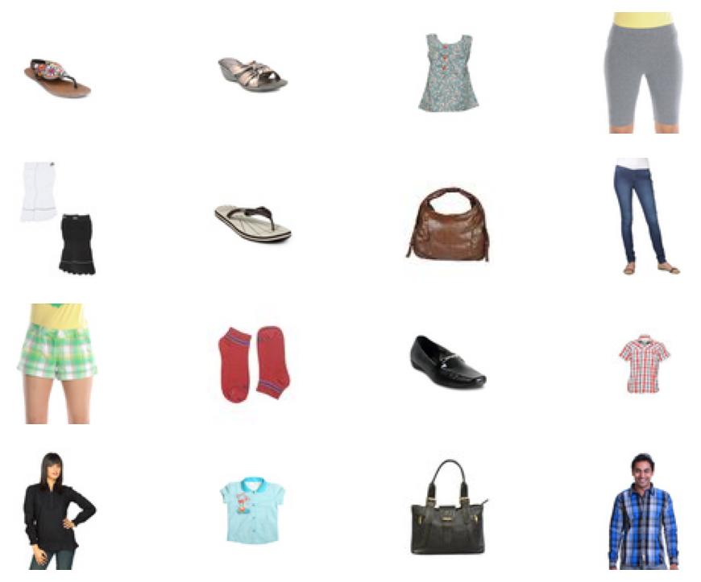

## Highlights

| Task | Best configuration | Result |
|---|---|---|
| Shape (KNN), `test_imgs` (851 images) | raw pixels, K=2, Euclidean / Manhattan | **> 90 %** accuracy |
| Shape (KNN), any K = 2…10 | raw pixels, any metric | 88.8–92.1 % on `test_imgs`; K barely matters |
| Color (K-Means), cropped images | random / k-means++ / PCA init, K = 9–10 | **~64–68 %** color F1 |
| Color (K-Means), full images | custom / k-means++ init, K = 5–9 | ~55–58 % color F1 |

Main findings:

- **Simple wins for shape:** raw grayscale pixels with a low K beat every compressed feature set I tried (`mean_halves`, `grayscale_mean`, …) by a wide margin.
- **Cropping helps color:** removing the background gives K-Means cleaner colors (+~10 points). Its effect on shape recognition is measured with a cross-validated comparison (see [report, section 7](docs/REPORT.md#7-evaluation-corrections-errata)); the first version of that experiment was flawed.
- **Init matters for K-Means:** k-means++ gives the best speed/accuracy balance; PCA init reaches the highest accuracy at high K but is the slowest.

## How it works

### Shape classification (KNN)

Images are converted to grayscale (color is irrelevant for shape) and represented as a feature vector. Several feature types and distance metrics are implemented and benchmarked:

- **Features:** `raw`, `mean_rgb`, `mean_halves`, `grayscale_mean`
- **Distances:** Euclidean, Manhattan, cosine


### Color extraction (K-Means)

Each image is flattened into a cloud of RGB points. K-Means clusters them; each centroid is a dominant color, mapped to one of 11 named colors (Red, Orange, Yellow, Green, Blue, Purple, Pink, Brown, Black, White, Grey).

- **Initializations:** `first`, `random`, `custom`, `kmeans++`, `pca`
- **Heuristics to choose K:** WCD, BCD, Fisher score, Elbow


### Retrieval

Retrieve images by **color**, by **shape**, or **both**, ranked by color percentage and/or KNN vote confidence. Green borders are correct matches against the ground truth, red are errors.

| Search by shape — "Flip Flops" | Search by color — "Black" |
|---|---|
| 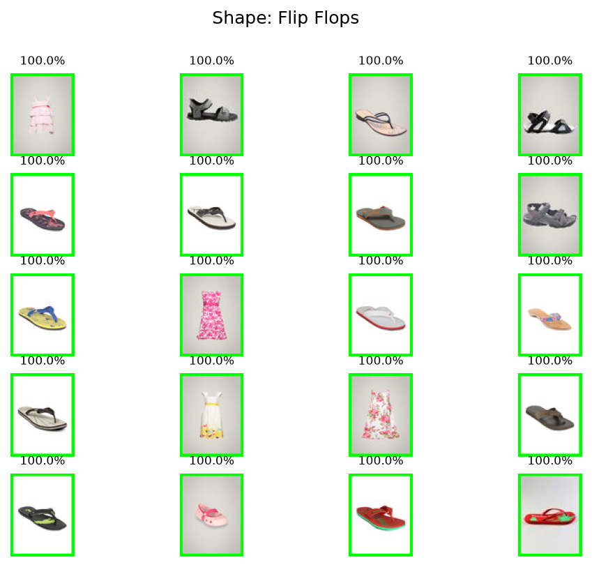 | 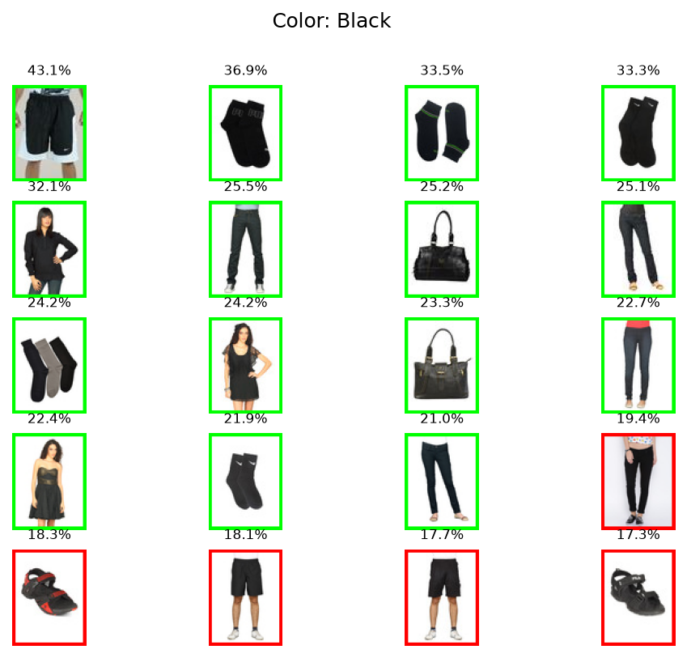 |

## Results

### Cropping: full vs cropped images

| Full images | Cropped images |
|---|---|
| 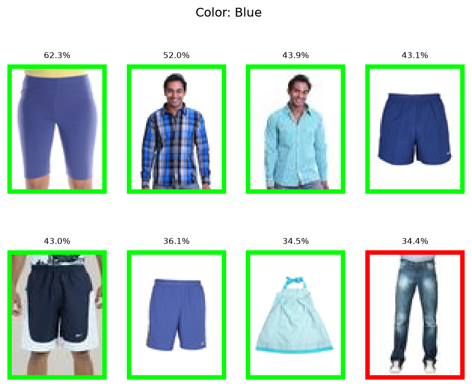 | 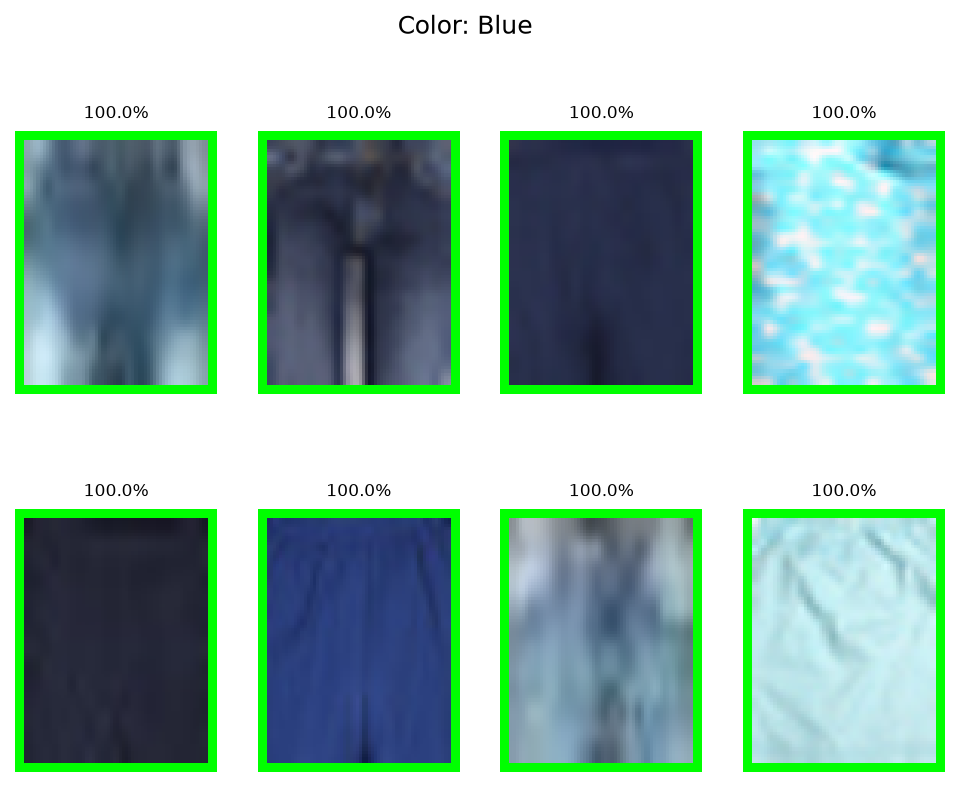 |
| 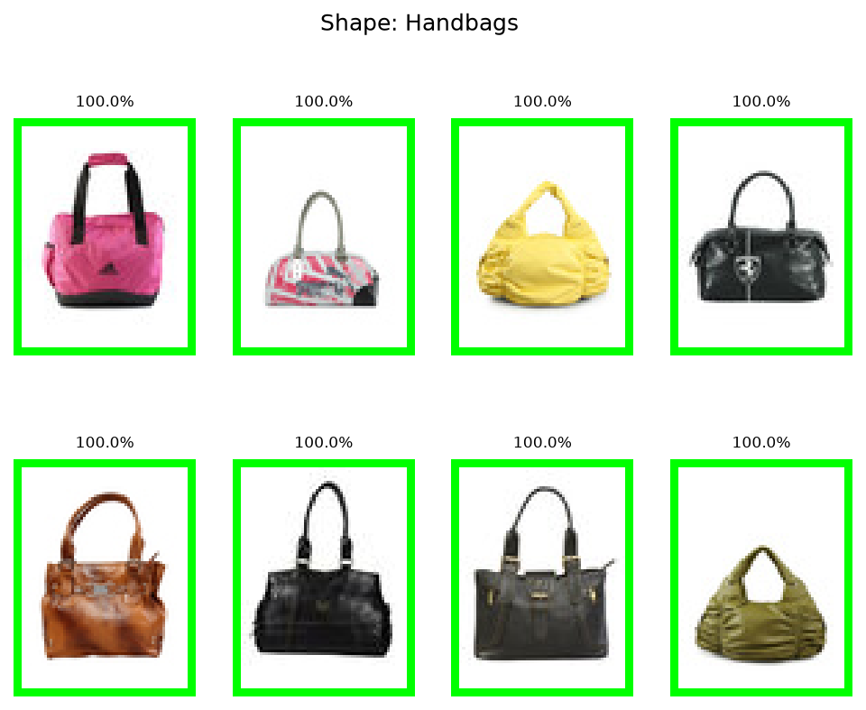 | 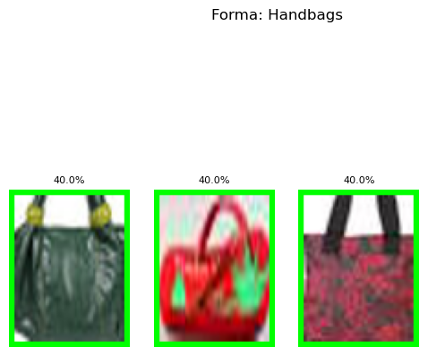 |
| 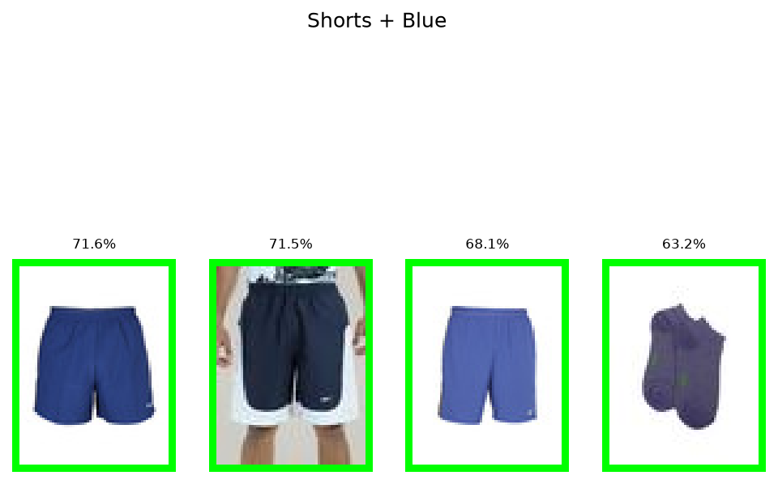 | 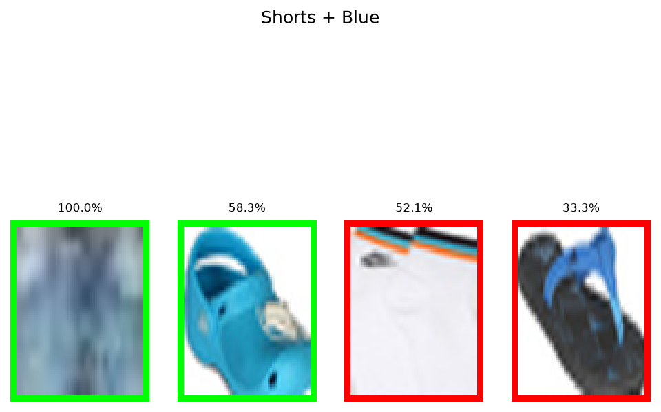 |

### K-Means analysis (cropped images)

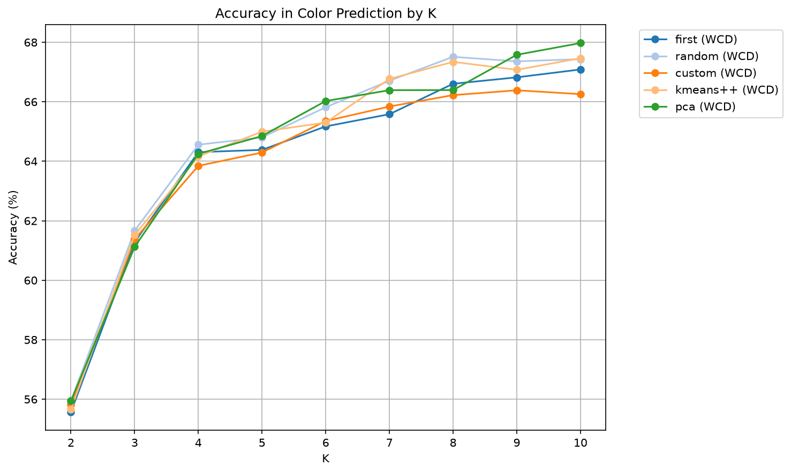

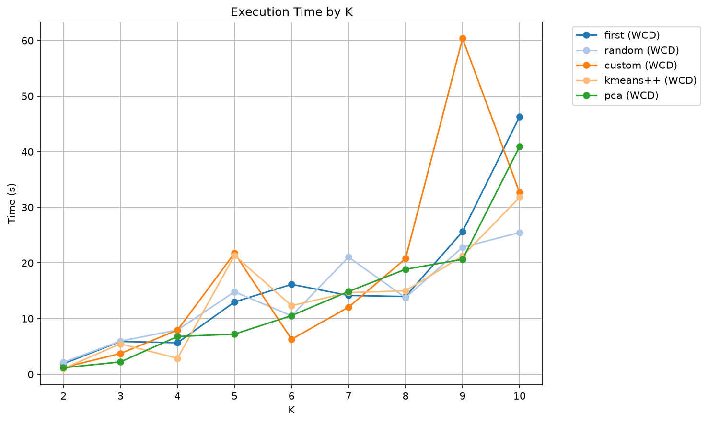

### KNN analysis (`test_imgs`)

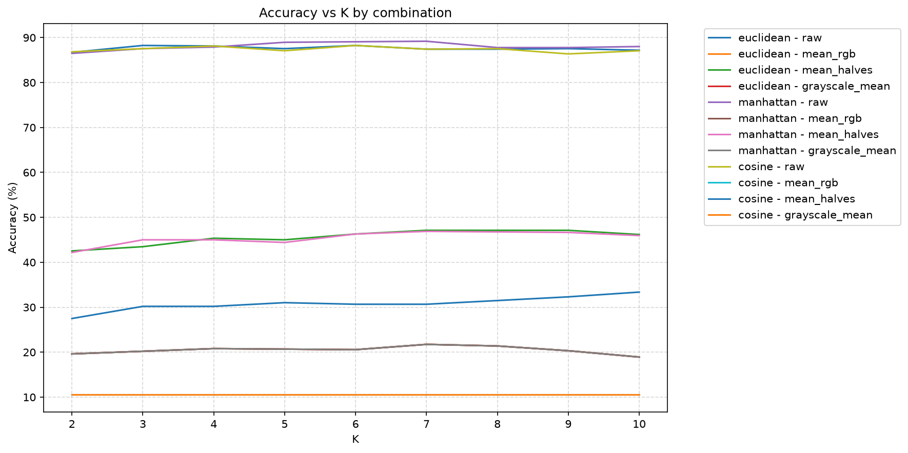

### Choosing K automatically

| Heuristic | Selected K | Color accuracy |
|---|---|---|
| WCD | 4 | 53.96 % |
| Elbow | 4 | 53.96 % |
| BCD | 10 | 56.41 % |
| Fisher | 10 | 56.41 % |

The full analysis (all datasets, all plots, discussion) is in the **[project report](docs/REPORT.md)**.

## Usage

```bash
git clone https://github.com/<your-user>/<repo-name>.git
cd <repo-name>
python -m venv .venv
source .venv/bin/activate        # Windows: .venv\Scripts\activate
pip install -r requirements.txt
python src/my_labeling.py
```

Always run it from the repository root: the paths are relative to the working directory (`./images/gt.json`, `./figures/`, `./results/`).

The program opens an interactive menu:

```
=== MAIN MENU ===
1. Run systematic KMeans (full analysis)
2. Run systematic KNN (full analysis)
3. Run interactive KMeans
4. Run interactive KNN
5. Search
6. Visualize dataset images
7. Compare find_bestK methods
8. Exit
9. Generate ALL figures and results (saved to figures/ and results/)
```

### Reproducing every figure and result

Option **9** runs all the analyses on every dataset (`imgs`, `imgs-cropped`, `test-imgs`) without opening any window and writes:

- `figures/*.png` — every plot used in this README and in the [report](docs/REPORT.md), e.g. `kmeans_imgs-cropped_accuracy.png`, `knn_test-imgs_accuracy-vs-k.png`, `retrieval_cropped_color-blue.png`
- `results/*.json` — the raw numbers behind each figure (`kmeans_<dataset>.json`, `knn_<dataset>.json`, `find-bestk_<dataset>.json`, …) plus `results/summary.json` with the status and elapsed time of each stage

After it finishes, run `python src/update_report_tables.py` to fill the corrected-results tables of the report ([section 7.4](docs/REPORT.md#7-evaluation-corrections-errata)) from `results/*.json`.

It can take **several hours**. Every stage is saved as soon as it finishes, a failing stage does not stop the rest, and you can resume a previous run by answering `y` to *"Skip stages whose JSON already exists"*.

## Data

The dataset is **not included** in this repository. See [`images/README.md`](images/README.md) for where to obtain it and the expected layout (`images/train`, `images/test`, `images/gt.json`). It contains clothing images of 9 shape classes (Dresses, Flip Flops, Jeans, Sandals, Shirts, Shorts, Socks, Handbags, Heels) with shape and color ground-truth labels.

## Repository structure

```
.
├── README.md
├── requirements.txt
├── src/
│   ├── my_labeling.py     # labeling functions, retrieval, analyses, interactive menu, option 9
│   ├── update_report_tables.py  # fills the corrected-results tables of the report from results/*.json
│   ├── KNN.py             # KNN classifier
│   ├── Kmeans.py          # K-Means clustering
│   └── utils.py, utils_data.py, …
├── test/                  # test cases for KNN and K-Means
├── images/                # dataset (train / test) — not versioned in full
├── figures/               # generated plots (option 9)
├── results/               # generated JSON results (option 9)
└── docs/
    ├── REPORT.md          # full project report (English)
    ├── report_ca.pdf      # original report (Catalan)
    ├── presentation.pdf   # slides
    └── images/            # two static diagrams used in the README / report
```

## Evaluation correction

While preparing this repository we found two errors in the original KNN evaluation: the extended dataset (`imgs`) was also part of the KNN training set (which produced a 100 % accuracy by construction), and the cropped training set was built with the crop windows of other images. Both are fixed in this version and fully documented in [section 7 of the report](docs/REPORT.md#7-evaluation-corrections-errata), including which conclusions of the original submission no longer hold. K-Means color results were not affected.

## Known limitations

- `cosine` distance on 1-D features (`grayscale_mean`, `mean_rgb`) is degenerate: every pair of images ends up at the same distance, so accuracy collapses to chance level (~11 % for 9 classes).
- Images are converted to grayscale before KNN feature extraction, so `mean_rgb` effectively reduces to the grayscale mean and gives the same results.
- Non-`raw` features are computed with a Python loop per image pair, so their timings are much higher than `raw` (which uses vectorized `scipy.spatial.distance.cdist`). The time differences reflect the implementation, not only the features.
- With K=2 and ties broken by order, KNN behaves like 1-NN.

## Authors

- Josep Montoro Pascual
- Alejandro Zorrilla Bejarano
- Roger Salcedo Roquet

## License

Add a license of your choice (e.g. MIT). Check that the course material and dataset allow public redistribution before publishing.
