# Color and Shape Labeling in Clothing Images

**Group 74 – Artificial Intelligence** · May 22, 2025
Alejandro Zorrilla Bejarano · Josep Montoro Pascual · Roger Salcedo Roquet

> English translation of the original report (Catalan). Figure labels in the plots may still appear in Catalan/Spanish. Sections 6 and 7 were added in the English version; section 7 documents errors in the original evaluation that were found and corrected afterwards, and several results in sections 2, 5 and 6 are marked as superseded.

## Contents

1. [Introduction](#1-introduction)
2. [Analysis methods](#2-analysis-methods)
3. [Improvements over K-Means and KNN](#3-improvements-over-k-means-and-knn)
4. [Other implementations](#4-other-implementations)
5. [Overall conclusion](#5-overall-conclusion)
6. [Known limitations (added)](#6-known-limitations-added)
7. [Evaluation corrections (errata)](#7-evaluation-corrections-errata)

---

## 1. Introduction

In this project we explore a real-world case of automatic classification of clothing items with artificial intelligence. On the one hand, we identify the **shape** of the garment (shirt, trousers, flip-flops, etc.) with the K-Nearest Neighbors (KNN) algorithm. On the other hand, we extract the **predominant colors** of the garment with K-Means.


### 1.1 Methodology

#### 1.1.1 Data preparation

We define all the image sets we can work with, from which the user can later choose to run the experiments: `imgs` (180 images), `test_imgs` (851), and their cropped versions (`cropped_images`, `cropped_resized`, 180 each).

#### 1.1.2 Feature extraction

**KNN.** The goal is to identify the shape of the garment. Since color is not relevant for this, all images are converted to grayscale. Each image is then represented as a feature vector: either the value of all pixels (`raw`) or a summarized version using statistics such as the global pixel mean or the mean of the upper and lower halves (`mean_halves`). This lets us compare different strategies.


**K-Means.** The goal is to find the dominant colors of an image, so we do **not** convert to grayscale; we use the RGB values directly. For each image, the pixel matrix is flattened into a set of points in a three-dimensional (R, G, B) space. K-Means groups pixels by proximity, and each cluster represents a predominant color. The example below shows an original image, a "reduced" version with few colors, and the 3D point cloud where the color groupings can be seen.


#### 1.1.3 Algorithm implementation

Both algorithms have configurable options that allow us to analyze how the choice affects performance and accuracy.

**KNN** (shape classification):

- *Distance type:* Euclidean, Manhattan or cosine, computed over the image feature vectors to find the most similar training samples to a test image (explained in section 3.2).
- *Feature type:* `raw`, `mean_rgb`, `mean_halves` or `grayscale_mean` (explained in section 3.2).

**K-Means** (dominant colors):

- *Centroid initialization* (5 types): `first` (first K points as centroids), `random` (random centroids), `custom` (manually defined strategy), and later `kmeans++` and `pca` (explained in section 3.1).
- *Heuristics to choose the best K:*
  - **WCD** (Within-Class Distance): measures internal compactness of clusters.
  - **BCD** (Between-Class Distance): measures separation between clusters.
  - **Fisher score:** ratio between BCD and WCD, seeking maximum separation and minimum internal dispersion.

#### 1.1.4 Qualitative analysis

After running the algorithms with the user's selected options, results are shown visually with functions such as `visualize_k_means` or `mostrar_retrieval` (section 4). These use the qualitative analysis methods defined in section 2, which sort the images by their match percentage with the assigned labels (shape, color, or both). Finally, a visual plot shows the images with the highest reliability, giving a final visual check of whether the algorithms work correctly or can be improved.

#### 1.1.5 Quantitative analysis

To evaluate the algorithms we implemented several quantitative analysis methods.

**Accuracy.** For KNN we compute accuracy for the different distances and feature types, together with execution time, to find the most efficient combination. For K-Means we do the same with color labels, considering both original and cropped images: in theory, cropping removes unnecessary colors in the image corners, so accuracy should increase.

**Heuristics.** We generate plots showing the evolution of the different heuristics as a function of K and analyze which one gives the best behavior:

- **WCD:** should decrease as K increases.
- **BCD:** should increase as K increases, since clusters become more separable.
- **Fisher:** combines both and should increase with K.

We built the project as a menu so the user can choose which results they want; once the results for a topic are available, they can be analyzed to see which options give the best final outcome.

---

## 2. Analysis methods

This section describes the methods used to evaluate the KMeans and KNN classifiers visually and numerically.

### 2.1 Qualitative analysis

#### 2.1.1 Retrieval by color

**Goal:** search for images containing specific colors and rank them by how dominant those colors are.

**Inputs:**

- List of images.
- Color labels predicted by K-Means for each image (e.g. `["Red", "Blue"]`).
- Colors to search (e.g. `query_colors = ["Red", "Blue"]`).
- Optional: percentage of each color in the image (used for ranking).
- Optional: whether to return a score.

**Processing:**

1. Filter images that contain at least one of the searched colors.
2. If percentages are provided, sort images by the sum of the percentages of the matching colors.
3. Return the score if this option is active.

**Output:** images ranked by relevance (e.g. highest percentage of "Red" first).

*Search for cropped images with blue color:*


*Search for images with blue color:*


In the analyzed examples we search for blue garments. Cropped images clearly give better color search results than full images. The improvement is mainly due to the removal of the background during cropping, which often introduces noise and colors that are irrelevant for the analysis. Cropped images show a higher match percentage with the real colors of the object, because cropping removes background interference and lets K-Means focus exclusively on the garment's colors. The contrast is especially evident when comparing the full and cropped versions of the same image, where the cropped version identifies the predominant colors more accurately.

#### 2.1.2 Retrieval by shape

**Goal:** retrieve images matching a specific shape (e.g. "Shirts") and rank them by confidence (KNN votes).

**Inputs:**

- List of images.
- Shape labels predicted by KNN (e.g. `["Shirts", "Dresses"]`).
- Shape to search (e.g. `query_shape = "Shirts"`).
- Optional: percentage of votes among the nearest neighbors (confidence).
- Optional: whether to return a score.

**Processing:**

1. Filter images whose predicted label matches `query_shape`.
2. Sort images by vote percentage (e.g. an image with 90 % votes for "Shirts" appears before one with 70 %).
3. Return the score if this option is active.

**Output:** images ranked by prediction confidence.

*Search for handbags:*


*Search for handbags with cropped images:*


These examples show a significant difference between using full and cropped images for shape classification. While K-Means benefits from cropping to identify colors, KNN shows accuracy problems with cropped images, since the process removes critical parts needed to recognize shapes. A clear example is when a flip-flop is misclassified as a bag: after cropping, the strap region — key to telling a flip-flop from a bag — disappears, causing the error. Although cropping can be useful for color analysis, it is not suitable for shape classification, because it removes essential visual information.

> **⚠️ Correction (see [section 7](#7-evaluation-corrections-errata)).** The KNN results with cropped images in this section came from a classifier trained on a wrongly cropped training set (problem 2). The explanation about the missing strap is a plausible hypothesis, but these figures do not demonstrate it. The like-for-like comparison is in section 7.4.

#### 2.1.3 Combined retrieval

**Goal:** search for images that satisfy both criteria — shape **and** color — and rank them by a combined score.

**Inputs:**

- Color labels (K-Means) and shape labels (KNN).
- Shape (`query_shape = "Shirts"`) and colors (`query_colors = ["Red", "Blue"]`) to search.
- Color percentages and shape votes.

**Processing:**

1. Filter images matching the desired shape.
2. Among them, filter those containing the searched colors.
3. Compute a combined score from color percentage and shape votes.
4. Sort by this score.

**Output:** images that are, for example, "Shirts" with a predominance of "Red" or "Blue".

*Search for blue shorts:*


*Search for blue shorts with cropped images:*


The comparison shows that while the search on full images gives satisfactory results, the cropped version presents significant problems. This confirms what we saw in previous examples: cropping, although it improves color analysis, is counterproductive for searches that require recognizing both shape and color. Cropping removes essential parts of the garments that identify their shape — in the case of the blue shorts, some cropped images lose distinctive features such as the leg openings or the waistband — leading to classification confusion. This explains why the combined search works better with full images, which keep all the visual information needed for accurate identification.

> **⚠️ Correction (see [section 7](#7-evaluation-corrections-errata)).** The shape part of this cropped search used the same invalid cropped training set (problem 2); the color part is not affected.

### 2.2 Quantitative analysis

#### 2.2.1 `get_shape_accuracy`

**Goal:** evaluate the accuracy of a shape classification model (typically KNN) by comparing predictions with ground-truth labels.

**Inputs:** `preds` (predicted labels), `gts` (ground-truth labels in the same order), `return_errors` (optional flag to get an error breakdown; `False` by default).

**Processing:** for every prediction/truth pair, compare labels directly; count a hit if they match; otherwise, if requested, record the error type (`gt → pred`) and count its frequency.

**Output:** the hit percentage, or with `return_errors=True`, a tuple with the hit percentage and a dictionary `{(true_gt, wrong_pred): count}`.

#### 2.2.2 `get_color_accuracy`

**Goal:** compute color classification accuracy with the **F1-score**, which combines precision and recall into a single value. It is especially useful for evaluating color labeling models such as K-Means.

**Inputs:** `pred_labels` (list of sets of predicted labels, e.g. `[{'Red','Blue'}, {'Green'}, ...]`) and `gt_labels` (ground truth, same format).

**Processing:** verify equal lengths; for each image compute true positives, false positives and false negatives; precision = tp / (tp + fp); recall = tp / (tp + fn); F1 = 2·precision·recall / (precision + recall); handle division-by-zero cases.

**Output:** the mean F1-score, as a percentage, over all images.

#### 2.2.3 `kmeans_analysis`

**Goal:** an exhaustive analysis of K-Means for different values of K (from 2 to Kmax) with several initialization methods and heuristics.

**Configuration and execution:**

- Tests 5 initialization methods: `first`, `random`, `custom`, `kmeans++` and `pca`.
- Uses the WCD heuristic to evaluate results.
- For each combination (initialization + heuristic + K): builds and fits a K-Means model, records the heuristic value, execution time and iterations, predicts colors for every image and computes accuracy.

**Visualization:** (1) heuristic (WCD) evolution vs K; (2) color prediction accuracy vs K; (3) execution time per configuration.

**Interpretation:** WCD shows how intra-cluster distance varies with K; accuracy identifies the optimal K for color classification; execution times help evaluate computational efficiency.

##### Results on `imgs`

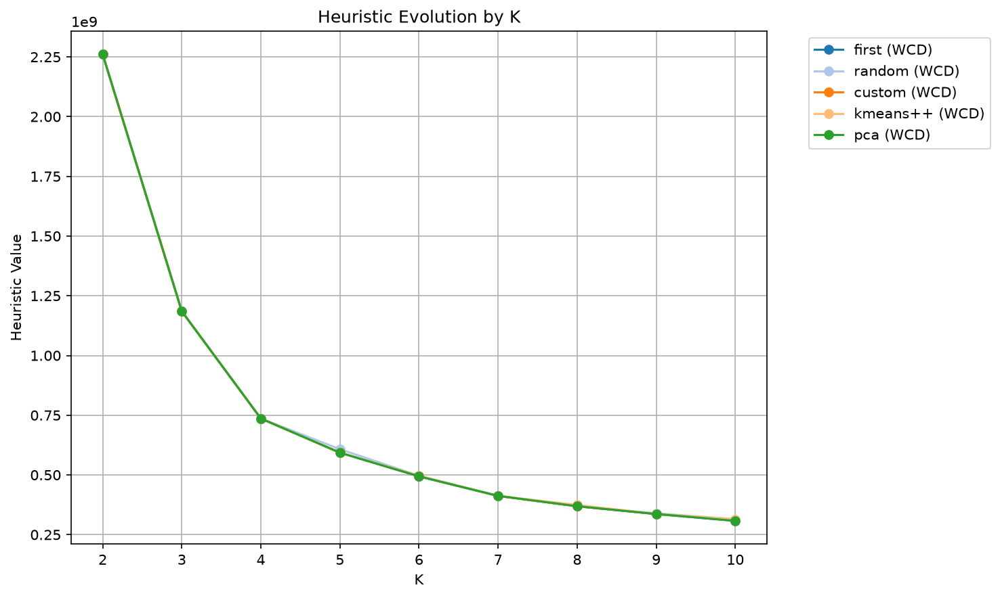

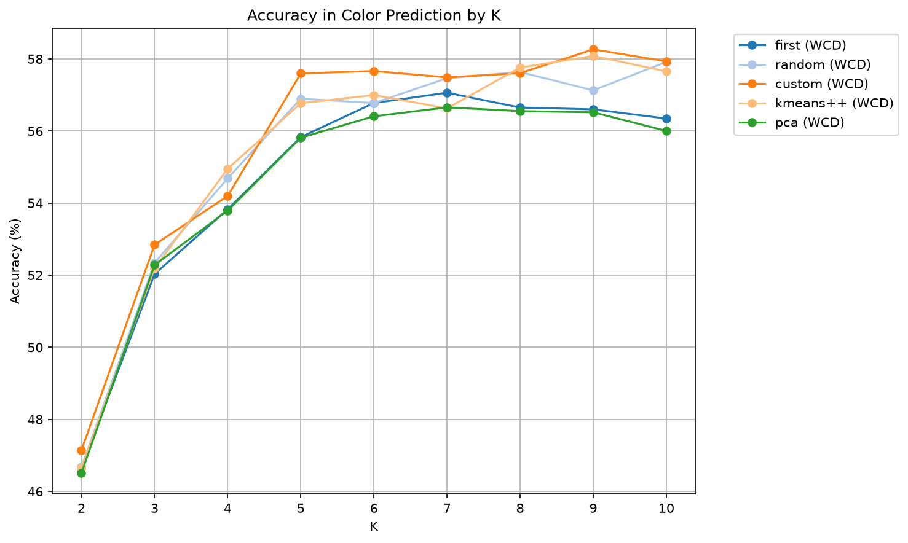

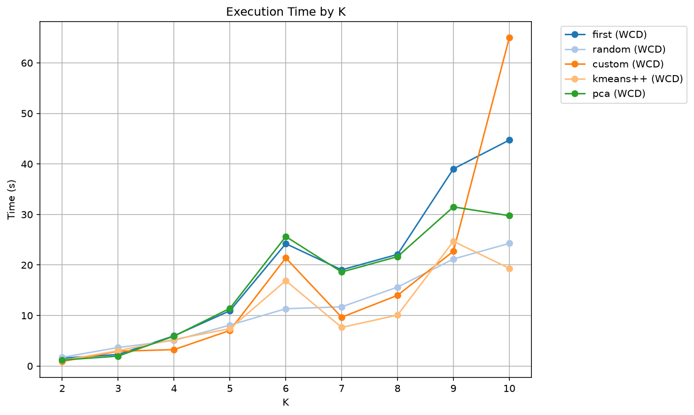

| Initialization | Mean time (s) | Mean accuracy |
|---|---|---|
| first | 18.77 | 54.76 % |
| random | 8.45 | 55.61 % |
| custom | 15.39 | 55.70 % |
| kmeans++ | 10.45 | 55.69 % |
| pca | 15.33 | 54.62 % |

##### Results on `imgs_cropped`

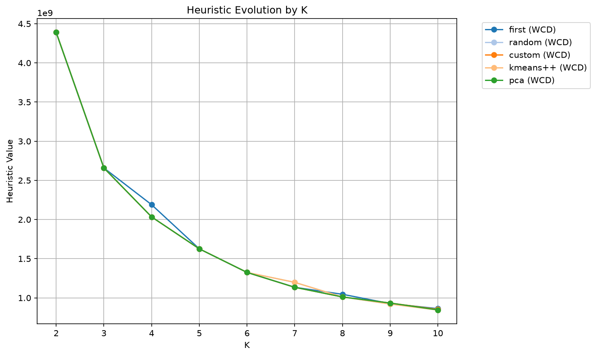


| Initialization | Mean time (s) | Mean accuracy |
|---|---|---|
| first | 15.62 | 64.32 % |
| random | 16.81 | 64.91 % |
| custom | 17.55 | 64.21 % |
| kmeans++ | 13.48 | 64.83 % |
| pca | 22.67 | 64.83 % |

##### Results on `test_imgs`

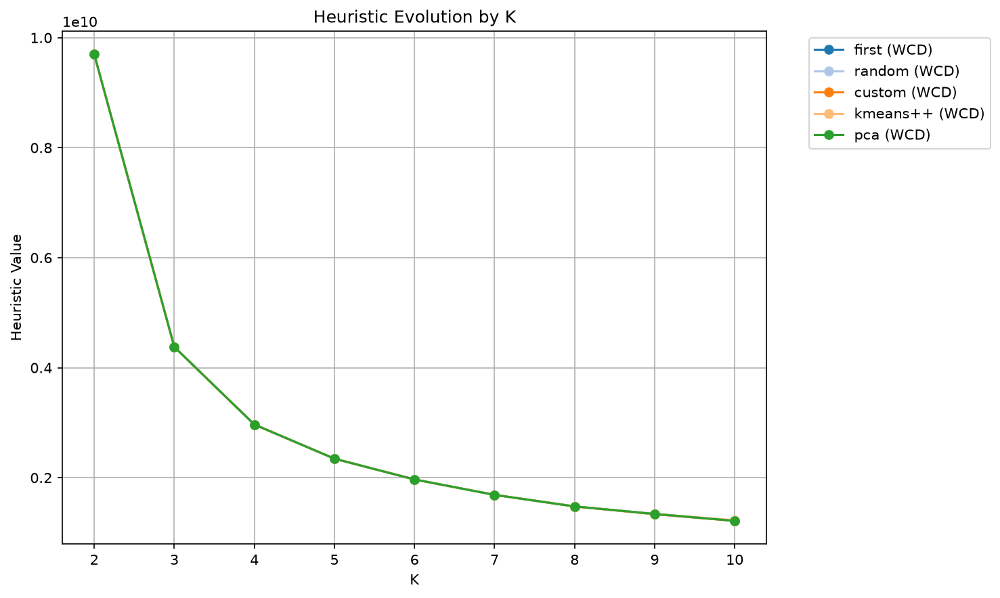

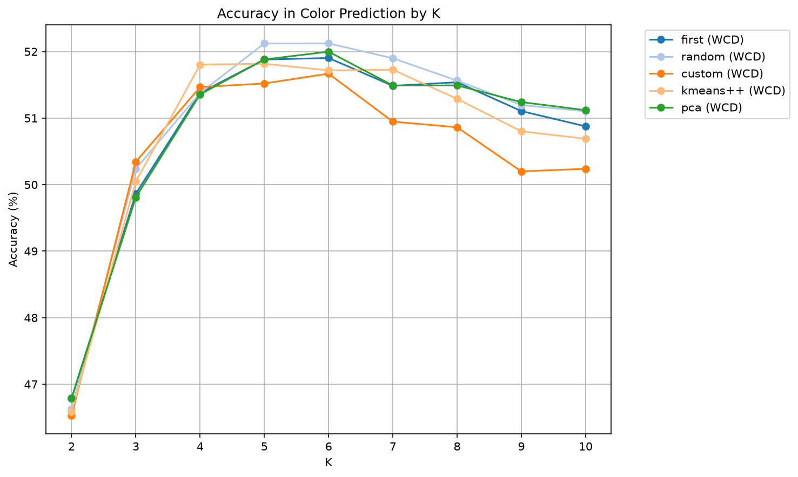

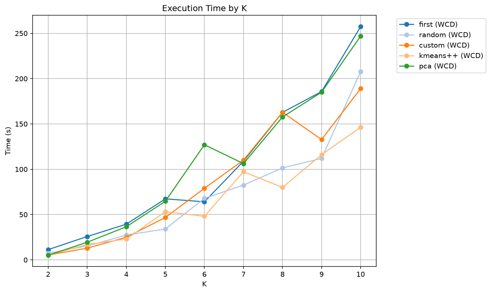

| Initialization | Mean time (s) | Mean accuracy |
|---|---|---|
| first | 106.15 | 50.74 % |
| random | 58.96 | 50.97 % |
| custom | 78.49 | 50.45 % |
| kmeans++ | 65.35 | 50.75 % |
| pca | 102.72 | 50.78 % |

##### Conclusions of the three analyses

- **WCD behavior:** WCD decreases as K increases, indicating greater cohesion within clusters. The improvement levels off beyond a certain K, so adding more clusters brings no significant benefit.
- **K vs accuracy:** accuracy generally improves with higher K but can stagnate or even decrease when K is too large, due to overfitting. This is especially noticeable in `test_imgs`, where accuracy decreases from K=6.
- **Initialization methods:** `random` stands out for speed, but its accuracy drops at high K (especially K=9 and K=10). Methods such as k-means++ or PCA keep more stable accuracy, although they need more computation time.
- **Cropping (`img_cropped`):** cropped images give higher color classification accuracy because they remove background noise. The process is, however, slower than with the original images.
- **Datasets (`imgs` vs `test_imgs`):** on `imgs` (cropped and original), accuracy grows consistently with K. On `test_imgs` it decreases from K=6, possibly due to overfitting or lack of generalization. Execution time on `test_imgs` is much higher because of the larger dataset.
- **Optimal K:** for `test_imgs` the ideal K is between 2 and 5, since higher values reduce accuracy and increase computational cost without clear benefits (the only exception is `random` initialization, where K=6 performs best). For `imgs`, higher K (up to 10) can be useful, as accuracy stays high without an excessive increase in processing time.

#### 2.2.4 `knn_systematic_analysis`

**Goal:** exhaustively evaluate KNN with different parameter combinations to determine the optimal configuration for shape classification in clothing images.

**Inputs:** training set and labels, test set and labels.

**Processing:**

1. Load training and test data; initialize result containers.
2. For every combination of parameters (K, metric, features): train the KNN model, predict, compute accuracy and store the result.
3. Show a detailed summary sorted by accuracy, compute grouped means and generate comparison plots.

**Output:** for each K, the metric, the features and the accuracy.

##### Results on `imgs`

> **⚠️ Correction (see [section 7](#7-evaluation-corrections-errata)).** These figures and the table below are the **original** results. The test images were also in the KNN training set (problem 1), so the 100 % at K=2 is an artifact. Corrected values: section 7.4, Table 7.1.

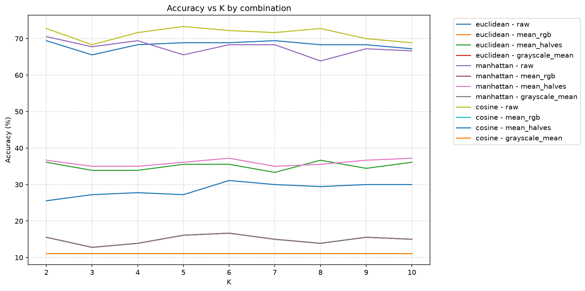

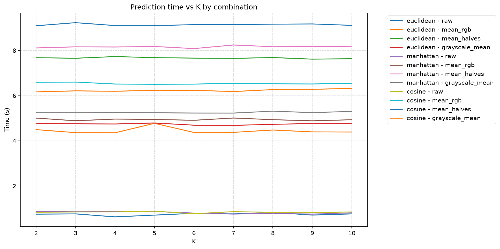

| Metric, features | Mean accuracy | Mean time (s) |
|---|---|---|
| cosine, raw | 86.98 % | 1.34 |
| euclidean, raw | 86.36 % | 0.97 |
| manhattan, raw | 85.68 % | 1.19 |
| cosine, mean_halves | 64.44 % | 13.43 |
| euclidean, mean_halves | 62.90 % | 16.00 |
| manhattan, mean_halves | 61.67 % | 11.98 |
| euclidean, grayscale_mean | 61.11 % | 10.00 |
| manhattan, grayscale_mean | 61.11 % | 7.88 |
| cosine, grayscale_mean | 11.11 % | 13.35 |
| euclidean, mean_rgb | 61.11 % | 9.52 |
| manhattan, mean_rgb | 61.11 % | 8.73 |
| cosine, mean_rgb | 11.11 % | 8.99 |

##### Results on `imgs_cropped`

> **⚠️ Correction (see [section 7](#7-evaluation-corrections-errata)).** **Original** results, obtained with a broken cropped training set (problem 2). Do not interpret them as the effect of cropping. Corrected values: section 7.4, Tables 7.2 and 7.3.

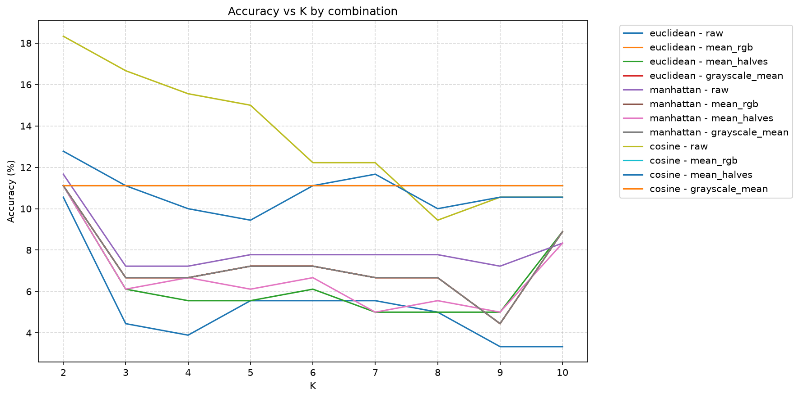

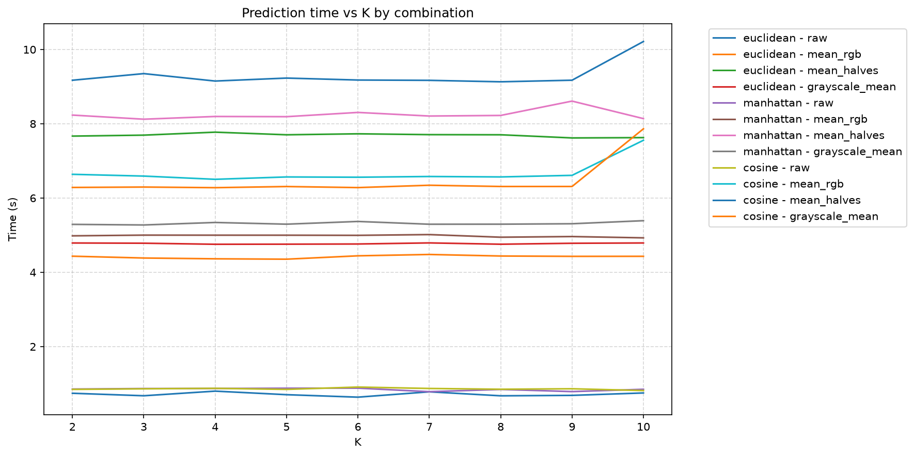

| Metric, features | Mean accuracy | Mean time (s) |
|---|---|---|
| manhattan, raw | 21.48 % | 0.08 |
| euclidean, raw | 20.43 % | 0.09 |
| cosine, raw | 18.77 % | 0.12 |
| cosine, mean_halves | 14.88 % | 1.22 |
| euclidean, mean_halves | 12.90 % | 1.25 |
| manhattan, mean_halves | 11.79 % | 1.01 |
| cosine, grayscale_mean | 11.11 % | 1.06 |
| cosine, mean_rgb | 11.11 % | 0.91 |
| euclidean, mean_rgb | 10.80 % | 0.73 |
| euclidean, grayscale_mean | 10.80 % | 0.68 |
| manhattan, mean_rgb | 10.80 % | 0.64 |
| manhattan, grayscale_mean | 10.80 % | 0.63 |

##### Results on `test_imgs`


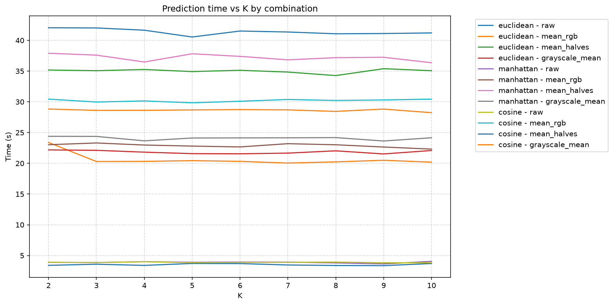

| Metric, features | Mean accuracy | Mean time (s) |
|---|---|---|
| manhattan, raw | 90.72 % | 4.58 |
| euclidean, raw | 90.22 % | 4.24 |
| cosine, raw | 90.16 % | 6.82 |
| euclidean, mean_halves | 53.31 % | 44.26 |
| manhattan, mean_halves | 52.76 % | 47.38 |
| cosine, mean_halves | 41.13 % | 72.47 |
| manhattan, grayscale_mean | 32.52 % | 36.26 |
| euclidean, mean_rgb | 32.52 % | 31.98 |
| manhattan, mean_rgb | 32.52 % | 27.48 |
| euclidean, grayscale_mean | 32.52 % | 26.36 |
| cosine, mean_rgb | 10.58 % | 58.09 |
| cosine, grayscale_mean | 10.58 % | 48.25 |

##### Analysis of the KNN results

> **⚠️ Correction (see [section 7](#7-evaluation-corrections-errata)).** The claims that K=2 is optimal, that accuracy reaches 100 %, and that cropped images are not recommended for KNN were drawn from the original (affected) runs and are **superseded**. What still holds: on `test_imgs`, raw features reach ~90 % with any metric, far above the other feature types (see section 7.4).

The results show that parameter selection is decisive for KNN performance. The optimal configuration is **K=2 with RAW features and Euclidean or Manhattan metric**, reaching 100 % accuracy with execution times below one second. This combination optimizes both accuracy and speed.

A clear pattern appears: as K increases, accuracy decreases significantly. This is explained by the inclusion of farther neighbors, which introduce noise and dilute the relevant local patterns. The drop is notable, from 100 % (K=2) to 80 % (K=10), without any gain in speed or other metrics.

Among the least effective combinations, `mean_rgb` or `grayscale_mean` features with the cosine metric perform exceptionally poorly (11.11 % accuracy) with high execution times, and stay consistently low regardless of K — some parameter combinations can completely invalidate the algorithm. In contrast, RAW features behave robustly and consistently with all the evaluated metrics, especially at low K values. This reliability, combined with minimal execution times, makes them the most suitable option for practical KNN image classification.

- **Impact of cropping:** the `img_cropped` results confirm that using KNN with cropped images is not recommended: the loss of spatial information drastically reduces reliability, even though processing times are shorter.
- **`test_imgs`:** the three configurations with RAW features keep an accuracy consistently above 90 %. The cosine metric, except with RAW features, stays around 10 %. Execution times are uniform, with a single exception: a significant spike between K=7 and K=9.
- **Final conclusion:** careful parameter selection is critical. The key to success is simplicity: low K, RAW features and traditional metrics offer the best balance of accuracy, speed and reliability.

#### 2.2.5 `compare_find_bestK_heuristics`

**Goal:** evaluate different heuristics for determining the optimal number of clusters (K) in K-Means, comparing four methods:

- **WCD** (Within-Class Distance): minimizes intra-cluster distance.
- **BCD** (Between-Class Distance): maximizes inter-cluster distance.
- **Fisher:** maximizes the BCD/WCD ratio.
- **Elbow method:** identifies the point of diminishing returns.

**Inputs:** image set, maximum K (default `max_K = 10`), ground-truth labels.

**Processing:**

1. *Data preparation:* convert images into a pixel matrix (X); initialize result structures.
2. *Best-K search,* for each heuristic: time the execution, find the optimal K with `find_bestK`, run K-Means with that K, compute color prediction accuracy.
3. *Visualization:* generate comparison plots and print a detailed summary.

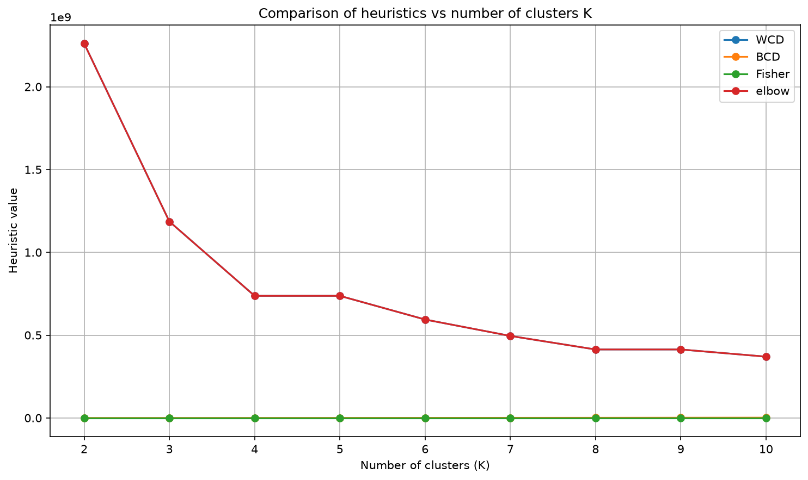

| Heuristic | Selected K | Accuracy |
|---|---|---|
| WCD | 4 | 53.96 % |
| BCD | 10 | 56.41 % |
| Fisher | 10 | 56.41 % |
| Elbow | 4 | 53.96 % |

**Analysis.** WCD and the Elbow method both identify K=4, with 53.96 % accuracy. These heuristics tend to select fewer clusters, offering a balance between simplicity and performance — well suited to quick analyses or limited resources. BCD and Fisher recommend K=10, reaching a slightly higher accuracy of 56.41 %. They can capture the structure of the data better when separation between groups is a priority, but the gain is only 2.45 points, which may not justify the extra complexity in many practical scenarios. The choice depends on the goal: efficiency and simplicity (WCD/Elbow) or maximum separation between groups (BCD/Fisher), with a relatively small accuracy difference between the two approaches.

---

## 3. Improvements over K-Means and KNN

### 3.1 K-Means improvements

**(a) Added initializations.** Two initialization methods were added to the existing ones:

- **k-means++:** selects initial points with probability proportional to their distance from the existing centroids.
- **PCA:** places centroids along the first principal component.

Applying `kmeans_analysis` to the cropped image set (see section 2.2.3):

- **k-means++** is the fastest method, with a mean execution time of 13.48 s, clearly better than PCA, the slowest at 22.67 s. It is an efficient option for large datasets or low-latency applications.
- **PCA** reaches the highest accuracy (68.36 %) at high K (K=10), despite being the slowest. It is ideal when accuracy matters more than execution time, especially with more clusters.

In short: to prioritize speed, use k-means++ for its optimal balance of time and accuracy; for maximum accuracy, use PCA, especially for K ≥ 8.

**(b) Heuristics for determining the optimal K.** Three new heuristics were implemented in `find_bestK`:

- **BCD** (Between-Class Distance): maximizes the distance between clusters.
- **Fisher score:** maximizes the ratio between inter-cluster and intra-cluster distance.
- **Elbow method:** identifies the point of diminishing returns in WCD.

Results are shown in the `compare_find_bestK_heuristics` analysis (section 2.2.5).

### 3.2 KNN improvements

**(a) Added distance metrics**

- **Manhattan distance:** less sensitive to outliers than Euclidean; better performance in high-dimensional spaces.
- **Cosine distance:** effective for comparing orientation rather than magnitude; useful when image size is not relevant.

**(b) Feature extraction methods**

- **Mean RGB:** computes the mean value of each RGB channel separately. Dimensionality: 3 features (R, G, B). Advantage: drastically reduces dimensionality while keeping color information.
- **Mean halves:** splits the image into upper and lower halves and computes the mean of each. Dimensionality: 2×channels (6 for RGB, 2 for grayscale). Advantage: captures basic spatial information with very low dimensionality.
- **Grayscale mean:** computes the mean value of the whole image in grayscale. Dimensionality: 1 feature. Advantage: maximum dimensionality reduction, although with significant information loss.

These implementations were studied in the KNN analysis (section 2.2.4).

---

## 4. Other implementations

### 4.1 `visualizarRetrievalAmbKMeans`

Visualizes retrieval results (by color, shape or combined). Shows the retrieved images ranked by relevance, with extra information such as color percentages or prediction confidence.

**Inputs:** `test_imgs`, `predicted_shapes` (KNN, optional), `color_preds` (K-Means, optional), `color_percentages`, `shape_votes`, `query_shape` and `query_colors`, flags `color`, `forma`, `ambos` (color, shape or combined search), `n` (number of images to show).

**Processing:** filter images by the search criteria; sort by relevance; display images with extra information and highlight hits/errors when ground truth is available.

### 4.2 `mostrar_retrieval`

Helper that shows retrieved images in a grid with their score.

**Inputs:** `retrieved_with_scores` (list of `(image, score)`), `n`, `title`, `ok` (optional list marking correct predictions).

**Processing:** select the `n` most relevant images, display them in a grid with their score, and highlight correct/incorrect ones if `ok` is provided.

### 4.3 `resize_images`

Resizes a set of images to a given size to standardize them for the algorithms. Especially useful when searching cropped images.

**Inputs:** `images`, `target_shape` (width, height, channels).

**Processing:** resizes each image with PIL and returns a NumPy array.

### 4.4 Interactive K-Means

Interactive interface to run K-Means with different configurations (initialization, heuristic, K) and visualize results.

1. Choose between original or cropped images.
2. Select initialization method (k-means++, PCA, …) and heuristic (WCD, BCD, …).
3. Automatically compute the best K or enter it manually.
4. Show color search results and visualize the generated clusters.

```
=== IMAGE TYPE SELECTION FOR KMEANS ===
1. Use original images
2. Use cropped images
3. Exit

Select initialization method: 1. first  2. random  3. custom  4. kmeans++  5. pca  6. exit
Select evaluation method: 1. WCD  2. BCD  3. Fisher  4. exit
Enter K manually (1) or search for the best K (2)? 2
Automatic K selected: 10
Processing images with KMeans (K=10, kmeans++, Fisher)...
Color prediction accuracy: 57.05 %
```

Example of a color search (Brown) with the K-Means visualization of a representative image:

> Retrieved images: 46 · top match percentage: 30.3 %

### 4.5 Interactive KNN

Interactive interface to run KNN with customizable settings (distance metric, feature type, K).

1. Choose between original or cropped images.
2. Configure K (2–10), metric (Euclidean, Manhattan, cosine) and feature type (`raw`, `mean_rgb`, …).
3. Show classification accuracy and the most frequent errors.
4. Includes interactive shape search.

```
Training images: 2328 · Test: 180 · Total: 2508
Enter K (2-10): 2
Metric: 3 (cosine) · Features: 4 (grayscale_mean)
Classifying images with KNN...
Classification accuracy: 100.00 %
```

### 4.6 Interactive search engine

Unified interface for combined searches (color + shape) with advanced configuration for K-Means and KNN.

1. Choose original or cropped images.
2. Supports search by color, shape or both.
3. Advanced options: heuristic and metric selection.
4. Results are shown sorted by relevance.

Default flow: K-Means runs with `find_bestK (WCD)` (K=4 detected automatically), then KNN with K=4, and the combined retrieval ("Shirts + Black") is displayed. In the advanced flow the user chooses the initialization, the evaluation method, K, the KNN metric and the feature type.

### 4.7 Main menu

The entry point of the application. It runs in a loop until the user chooses to exit:

1. **K-Means systematic analysis** — evaluates K-Means with different configurations (K, initialization, heuristics) for original and cropped images; choose the extended dataset or the test set.
2. **KNN systematic analysis** — exhaustive evaluation over (K, distance metric, feature type); compares results with/without cropping.
3. **Interactive K-Means.**
4. **Interactive KNN** — shape classification, shape search and error visualization.
5. **Interactive search engine** — combined color + shape search, with cropped-image support.
6. **Browse dataset images** — random samples of the extended dataset or the test set.
7. **`find_bestK` comparison** — WCD, BCD, Fisher and Elbow.
8. **Exit.**

The menu acts as a bridge between the user and the functions described in sections 4.1–4.5. Its modular structure makes it easy to add new functionality without touching the main logic. Before the systematic analyses a warning is shown that they may take several minutes, and before every option the user selects which dataset to work with (`imgs` or `test_imgs`).

---

## 5. Overall conclusion

Throughout this project we explored two artificial intelligence techniques for automatic labeling of clothing items: supervised learning with KNN for shape classification, and unsupervised learning with K-Means for dominant color extraction.

**KNN** showed high accuracy with `raw` features combined with Euclidean or Manhattan distances. With K=2 and raw features it reached 100 % accuracy on the extended dataset and more than 90 % on the test set. This shows that simple but informative representations can be very effective. When images are cropped, however, KNN performance worsens considerably because essential parts of the shape are lost.

For **K-Means**, the quantitative analysis identified the optimal configurations for color extraction. Cropped images gave better results, with a mean accuracy of 64.91 % using random initialization. The best initialization methods were k-means++ (good balance of time and accuracy) and PCA (maximum accuracy at high K). We also compared the WCD, BCD, Fisher and Elbow heuristics to find the optimal K, concluding that the best choice depends on the balance between simplicity and separation between groups.

The **combined color + shape searches** showed that combining two algorithms can be very powerful, but input data must be chosen carefully: cropping benefits color but can worsen shape identification.


> **⚠️ Correction (see [section 7](#7-evaluation-corrections-errata)).** The KNN recommendations below (K=2, the 100 % figure and avoiding cropped images) were written before the corrections; see section 7.5 for the updated conclusions. The color recommendations are unchanged.

**Recommendations for real applications**

- *Shape classification (KNN):* use K=2 with raw features and Euclidean/Manhattan distance (accuracy > 90 %); avoid cropped images if shape is a priority.
- *Color extraction (K-Means):* prefer k-means++ initialization (speed/accuracy balance) or PCA (maximum accuracy with K ≥ 8); crop images whenever possible to remove background noise.
- *Combined searches:* use the original images to preserve shape information, even at the cost of lower color accuracy.

In short, this project helped us better understand the strengths and limitations of simple machine learning techniques. We also saw that parameter choice and data type (cropped or not) directly affect performance, and that building a program to test different initializations and calculations is key to maximizing efficiency based on the results. This knowledge can be useful in more complex future projects combining supervised and unsupervised labeling.

---

## 6. Known limitations (added)

*This section was added in the English version and was not part of the original report.*

- **Cosine distance on 1-D features.** For `grayscale_mean` (and `mean_rgb` as implemented), each image is reduced to a single scalar. The cosine distance between two scalars of the same sign is always 0, so every neighbor is equally "close" and accuracy falls to chance level (~11 % for 9 classes), regardless of K.
- **`mean_rgb` is not RGB in practice.** The KNN pipeline converts images to grayscale before extracting features, so `mean_rgb` collapses to the grayscale mean, which is why both give identical results in the tables above.
- **Timing comparison.** With `raw` features and a standard metric, distances are computed in a vectorized way with `scipy.spatial.distance.cdist`; the other feature types use a Python loop over every test/train pair. Much of the time gap between `raw` and the other features comes from this implementation detail.
- **K=2 behaves like 1-NN.** With two neighbors and ties resolved by order, the prediction is effectively the label of the nearest neighbor, so with K=2 the classifier simply returns the label of the nearest neighbor. Together with the train/test overlap described in section 7 (problem 1), this is why K=2 looked best and accuracy seemed to decline as K grew on `imgs`.

---

## 7. Evaluation corrections (errata)

*Added after the original submission. While reviewing the code to publish this project we found two problems in how KNN was evaluated. This section explains what was wrong, what we changed, and which conclusions are affected.*

### 7.1 What we found

**Problem 1 – training images used as test images (`imgs`).** The extended dataset is read by `read_extended_dataset` from `images/train/`, the same folder the KNN classifier is trained on. When `imgs` was used as the test set, its images were also in the training set, so each test image found itself as its nearest neighbor at distance 0. With K=2 and ties broken by order the classifier behaves like 1-NN, so the accuracy was 100 % by construction, and it dropped as K grew only because other, non-identical neighbors entered the vote. That is the pattern we reported in section 2.2.4 and interpreted as "low K works best". The number of overlapping images is computed and stored on every run (see section 7.4).

**Problem 2 – invalid cropped training set.** Crop windows (`upper`, `lower`) only exist for the 180 images of the extended dataset. The original code applied them to the whole training set (`crop_images(train_imgs, upper, lower)`). Two things went wrong: `zip` silently truncated the training set to 180 images, and each of them was cropped with the window belonging to a *different* image, because the datasets are shuffled with different permutations. The "cropped training set" was therefore 180 arbitrary windows, not the cropped version of the training images. The same construction was used for the cropped test set (`test_cropped_resized`, 180 images paired with 851 labels, with accuracy divided by 851). The KNN accuracies with cropped images (~20 %) therefore mix the real effect of cropping with a broken training set, and cannot be attributed to cropping.

A related bug was fixed in the same review: the interactive search on the test set was passing `imgs` instead of `test_imgs`.

**What is not affected.** KNN on `test_imgs` (test images come from `images/test`, a separate folder) and all K-Means color results, including the improvement from cropping: the cropped images used for color are built from `imgs` with their own windows and are aligned with their ground truth.

### 7.2 Impact on the original conclusions

| Claim in the original report | Status |
|---|---|
| KNN reaches 100 % on `imgs` with K=2 | **Artifact** of problem 1; not a valid accuracy |
| K=2 is the optimal K | **Not supported** by `imgs`; on `test_imgs` raw accuracy stays between 88.8 % and 92.1 % for every K from 2 to 10 (best: K=2, cosine, 92.13 %) |
| Raw features outperform mean-based features | **Still holds** on `test_imgs` (~90 % vs at most ~53 %) |
| Cropped images reduce KNN accuracy to ~20 % | **Not valid** (problem 2); see Tables 7.2 and 7.3 |
| Cropping removes the strap, so a flip-flop is classified as a bag | **Hypothesis only**; not demonstrated by the original runs |
| Cropping improves color classification | **Still holds** (K-Means results unaffected) |

### 7.3 What we changed

- **Overlap removal.** `remove_overlap` removes from the KNN training set every image that appears (identical pixels) in the set used as test. It is applied everywhere `imgs` or `test_imgs` is a test set: systematic analysis, interactive KNN, interactive search and option 9.
- **Cropping only where it is valid.** Crop windows are applied only to `imgs`. "Cropped" KNN now means *train on the full training images, query with the cropped images*. Cropped images are not offered for the test set, which has no crop windows.
- **Like-for-like comparison.** New `knn_crossval_analysis`: stratified cross-validation on the 180 extended images, in three conditions (`full->full`, `cropped->cropped`, `full->cropped`), so that a test image is never in the training folds.
- **Retrieval figures.** The shape classifier used in the retrieval examples is trained on full training images with the overlap removed, for both full and cropped queries.
- **Interactive search bug.** The test-set search now uses `test_imgs`, `test_class_labels` and `test_color_labels`.
- **Reproducibility.** Every result file in `results/` records an evaluation `protocol` (`v2-no-overlap`). When option 9 is resumed, stages computed with an older protocol are recomputed automatically.

### 7.4 Corrected results

*This block is generated from `results/*.json` by `python src/update_report_tables.py` after running option 9.*

<!-- CORRECTED-RESULTS:START -->

_Run option 9 and then `python src/update_report_tables.py` to fill this section._

<!-- CORRECTED-RESULTS:END -->

### 7.5 Updated conclusions

- The honest estimate of KNN shape accuracy is the one measured on `test_imgs`: about 90 %, with raw features and any of the three metrics. The 100 % figure on `imgs` should not be used.
- K has little influence on `test_imgs` (88.8–92.1 %). K=2 is not a special choice; the "lower K is better" trend came from the overlap.
- The effect of cropping on shape recognition must be read from Tables 7.2 and 7.3, not from the original ~20 % figures. The original recommendation to avoid cropped images for KNN is retained only as a hypothesis until those tables support it.
- All K-Means and color conclusions are unchanged.

### 7.6 Lesson learned

Both errors were silent: the code ran, produced plausible plots and even a perfect score. They were found by reading the data-loading code and checking where each array came from. Keeping the test set out of the training folder, comparing dataset sizes after every `zip`, and treating a 100 % accuracy as a warning would have caught them earlier.
